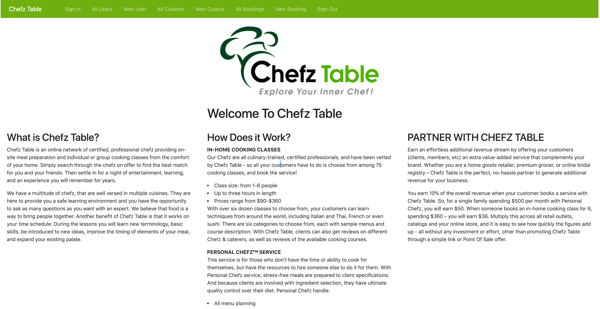
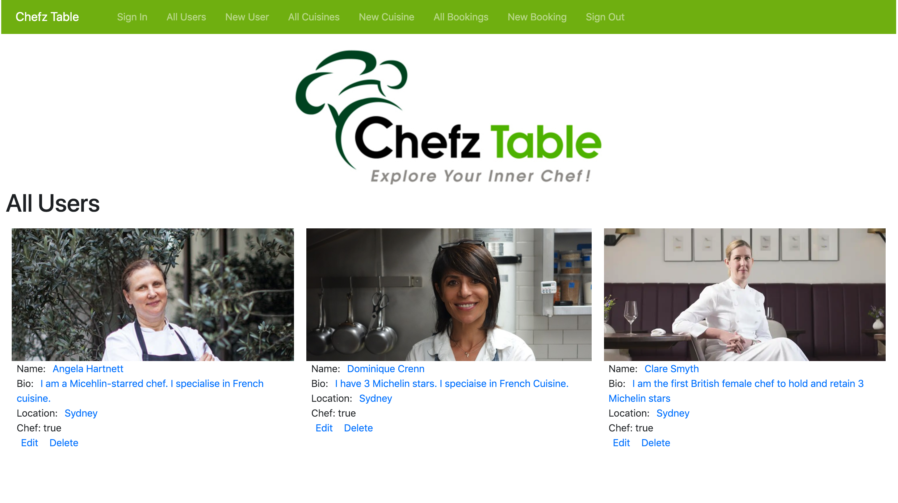

# README
# Project 1 Chefz Table

To get a closer look of the project visit: https://chefztable.herokuapp.com/

You may be asking yourself what exactly is Chefz Table?

Chefz Table is an online network of certified, professional chefz providing on-site meal preparation and individual or group cooking classes from the comfort of your home. Simply search through the chefz on offer to find the best match for you and your friends. Then settle in for a night of entertainment, learning, and an experience you will remember for years.

We have a multitude of chefz, that are well versed in multiple cuisines. They are here to provide you a safe learning environment and you have the opportunity to ask as many questions as you want with an expert. We believe that food is a way to bring people together. Another benefit of Chefz Table is that it works on your time schedule. During the lessons you will learn new terminology, basic skills, be introduced to new ideas, improve the timing of elements of your meal, and expand your existing palate.

After signing into the service you can view the chefz that we have on offer. As of right now it has placeholders of the pre-eminent culinary experts in the world. However, this gives you a sense of what it may look like in a finished product.

In addition there is the cuisines page that shows what our stable of chefz can teach you and your friends in the comfort of your own home.

## Objectives of Project 1
- Models: There should be at least three
- This app has: Users, Cuisines, and Booking model with a bonus join table between Users and Cuisines.
- Views: Use partials to DRY (Don’t Repeat Yourself) up your views.
- Handles invalid data. Forms in your application should validate data and handle incorrect inputs. Validate sign up information, verify valid email addresses and secure passwords.
- Use Gems: Use a GEM that talks to an API to add functionality to your app. 'bootstrap', 'jquery-rails', and 'cloudinary' were installed.
- User Login: There is a login for site, although can be viewed without one.
- Heroku: This app has been uploaded to Heroku.

## Built With
- Ruby on Rails
- Vanilla CSS
- Bootstrap CSS
- HTML

## Object Models
- User: has_secure_password and has_and_belongs_to_many :cuisines, :optional => true and
validates :email, :presence => true, :uniqueness => true
- Cuisines: has_and_belongs_to_many :users
- Bookings: belongs_to :user and has_many :cuisines

## Scope of Project as of 24-1-2019
- Signup as a customer or chef
- Sign in is via email
- Can use a profile photo but not required
- Can look at cuisines that are on offer and which chefs offer cuisine
- Can make a booking for a chef to come to you or your friend's home

## TODO
- Want to add a payment gateway
- Need to add an admin feature
- Would like to incorporate search functionality
- Would like to have an email with contact information sent to both customer and chef once a booking is made
- Need to insert script for cloudinary so that uploads are not truncated when posted on to the site

## Big Thanks
I would like to thank Joel for helping me formulate the relationships between my models and issues with my photos not showing correctly on my site.

A thank you to Linna for helping me with some layout issues that I had on this project.

And a thank you for Yianni of WDI-29 for his assistance on my controller issues and introducing me to the world of 'grid'. I will definitely be incorporating it in future projects.

This project was completed at General Assembly WDI-30 in Sunny Sydney, Australia, January 2019.
